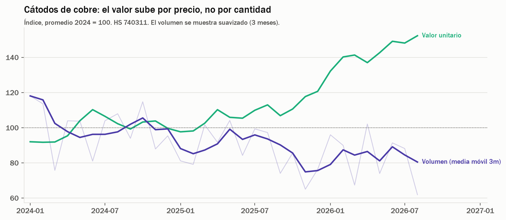
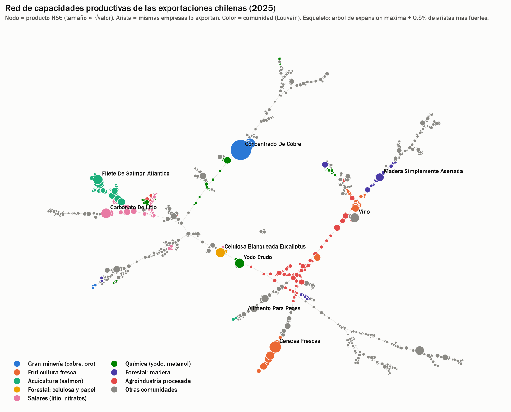
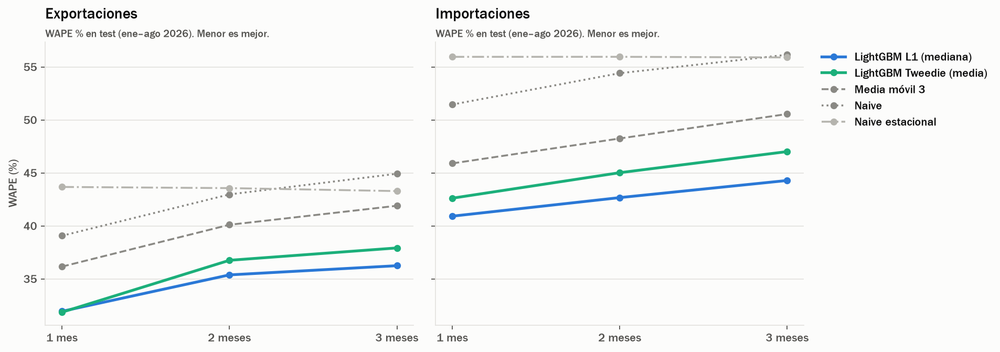
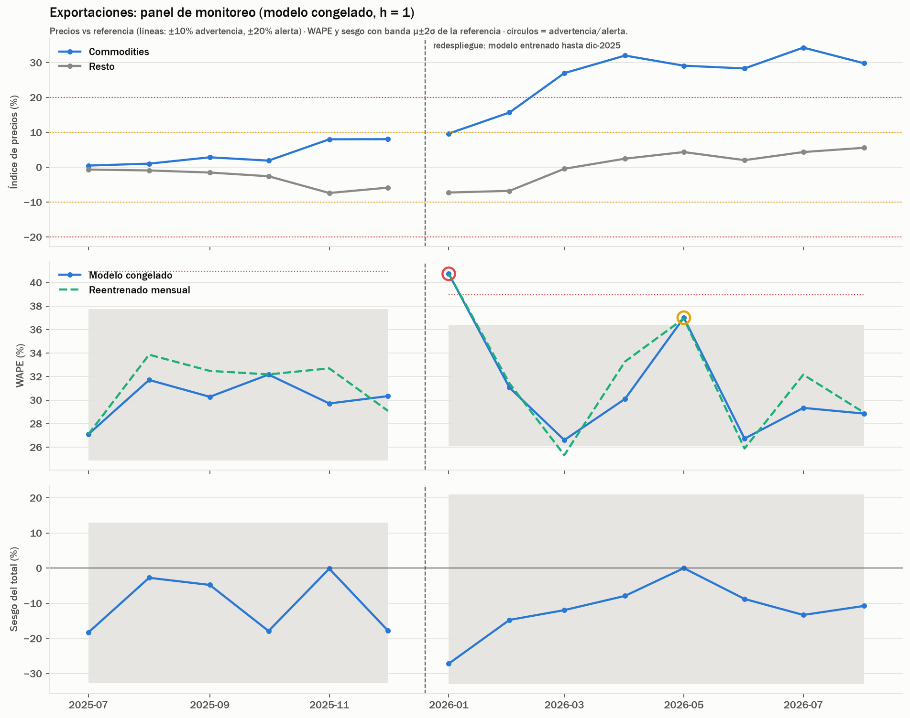
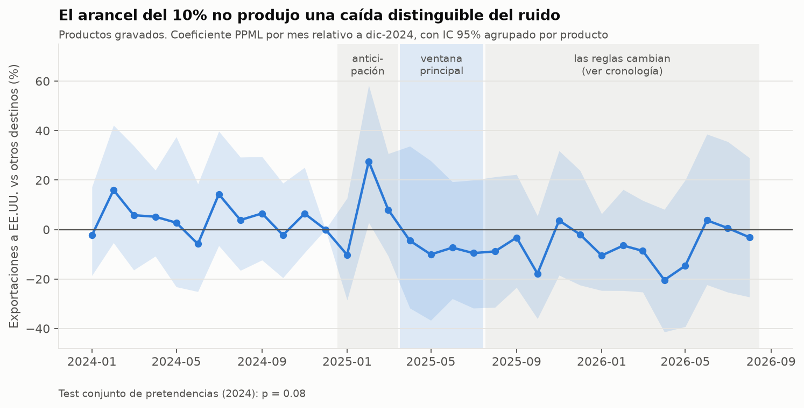
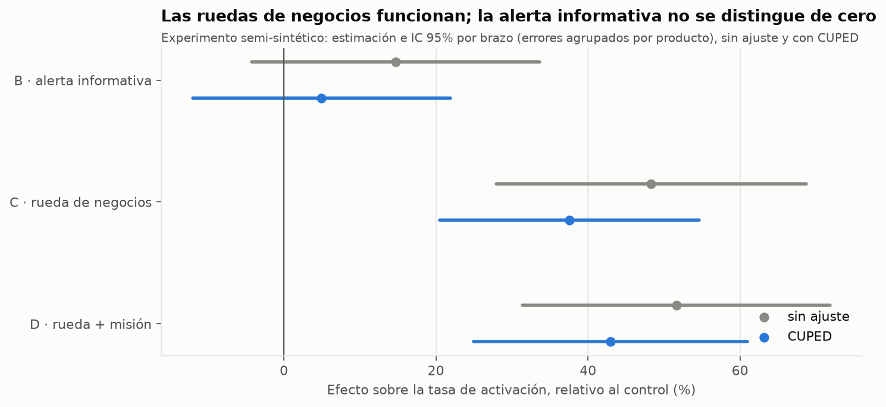

# Comercio exterior de Chile: análisis, grafos, forecasting, inferencia causal, experimentación y monitoreo de drift

Este es un proyecto de Data Science que hice de punta a punta con los registros de exportaciones e importaciones
del Servicio Nacional de Aduanas de Chile: 15,6 millones de ítems de declaraciones aduaneras entre enero de 2024 y
agosto de 2026. Pasa por la ingesta y validación de los datos crudos, el análisis exploratorio, una red de
capacidades productivas, modelos de pronóstico y clasificación con validación temporal, un sistema de monitoreo
de drift, un análisis causal del efecto de los aranceles de EE.UU. de 2025 y el diseño de un experimento A/B/n.

En este README cuento qué hice, por qué lo hice así y con qué problemas me fui encontrando. El detalle técnico de
cada decisión, con las alternativas que descarté, lo dejé en [`docs/PROYECTO.md`](docs/PROYECTO.md).

## Idea del proyecto

Chile es una economía pequeña y muy abierta: el comercio de bienes equivale a más de la mitad de su PIB, y sus
exportaciones dependen de pocos productos (cobre, litio, fruta, salmón, celulosa) y de pocos mercados. Eso la hace
sensible a los precios internacionales y a la demanda de socios como China. Me pareció un buen escenario para
trabajar con datos reales, grandes y desordenados, y no con un dataset ya limpio.

Mi idea era responder, con los registros oficiales de Aduana, cuatro preguntas que podría hacerse un analista de
comercio exterior o una agencia de promoción de exportaciones:

1. Qué explica la evolución reciente del comercio chileno y cuán concentrado está.
2. Qué productos comparten capacidades productivas y hacia qué mercados podría diversificarse Chile.
3. Cuánto se comerciará en los próximos meses, a nivel de producto y país, y si un flujo esporádico se va a
   repetir.
4. Cómo detectar cuándo un modelo en producción deja de ser confiable porque los datos cambiaron.

Cuando terminé, me quedaron dos preguntas que mis modelos no podían contestar, y las agregué como nuevas vueltas
del proyecto:

5. Cuánto afectaron los aranceles que impuso EE.UU. en 2025 a las exportaciones chilenas.
6. Cómo probar qué tipo de apoyo convierte una oportunidad de exportación en una exportación real.

Algo que tuve claro desde el principio fue no decidir de antemano si iba a hacer regresión o clasificación. Primero
quería entender cómo se comportaban los datos y, a partir de eso, elegir qué modelar.

## Metodología: CRISP-DM

Organicé el trabajo siguiendo el ciclo CRISP-DM (*Cross-Industry Standard Process for Data Mining*):

| Fase | Qué hice | Dónde |
|---|---|---|
| Comprensión del negocio | Definí las cuatro preguntas, sus objetivos analíticos y los criterios de éxito antes de evaluar: superar a baselines simples fuera de tiempo, cuadrar los totales con cifras oficiales y monitorear sin falsas alarmas | `docs/PROYECTO.md` §1 |
| Comprensión de los datos | Contrasté la documentación con los datos, revisé la calidad de 15,6 M de registros e hice el análisis exploratorio | `ingest.py`, `01_eda` |
| Preparación de los datos | Reparé registros dañados, imputé de forma exacta los valores truncados, armé el panel producto × país × mes y construí features sin leakage | `clean.py`, `features.py` |
| Modelado | Construí la red de capacidades productivas, un modelo global de pronóstico y un clasificador de flujos intermitentes, siempre comparados contra baselines | `02_grafo`, `03_regresion`, `04_clasificacion` |
| Evaluación | Evalué el test fuera de tiempo una sola vez, con intervalos de confianza, tests anti-leakage, una comparación de esquemas de validación y un contraste de cada resultado con las preguntas iniciales | `05_esquemas_validacion`, `docs/PROYECTO.md` §10 y §12 |
| Despliegue | Simulé el despliegue: un modelo congelado opera durante 2026 bajo un sistema de monitoreo con umbrales y un runbook de acciones. Entrego los resultados como repositorio reproducible, notebooks, figuras e informe técnico | `06_drift_monitoring`, `drift.py` |

En la práctica el ciclo no fue lineal. Varias veces un hallazgo me obligó a volver a una fase anterior:

- **Datos → negocio:** partí solo con los archivos de enero a agosto de 2026, y me di cuenta de que con 8 meses no
  podía modelar la estacionalidad, así que amplié el alcance a 2024–2026. Más adelante descubrí que los IDs de
  empresa se renumeran cada mes, y tuve que descartar todas las preguntas por empresa.
- **Modelado → preparación:** mi primer modelo global trabajaba en escala absoluta y subestimaba las series más
  grandes. Terminé reformulando el objetivo y las features como cambios relativos al nivel reciente.
- **Evaluación → modelado:** en un momento el modelo perdía contra una simple media móvil. Cambié la pérdida a L1 y
  agregué un modelo Tweedie para los totales. Además, uno de los tests automatizados detectó una fuga de
  información que se me había pasado, y la corregí.
- **Despliegue → evaluación:** al probar el monitoreo en un período de control encontré cinco errores en mi propio
  diseño, que corregí antes de mirar 2026.
- **Evaluación → negocio:** mis modelos predecían bien, pero predecir no es lo mismo que medir un impacto. Para
  responder cuánto afectaron los aranceles de EE.UU. tuve que recorrer el ciclo otra vez, ahora con inferencia
  causal (`07_inferencia_causal`). Y medir un efecto pasado tampoco dice qué conviene hacer, así que diseñé un
  experimento para probar intervenciones (`08_experimento_ab`).

No hice un despliegue productivo (un proceso programado, una API o un dashboard en operación). Preferí declararlo
así y cubrir esa etapa con un despliegue simulado y con los entregables del repositorio. Lo que faltaría para
operarlo de verdad está descrito en el informe técnico (§13).

## Datos

| Fuente | Contenido |
|---|---|
| [datos.gob.cl, Servicio Nacional de Aduanas](https://datos.gob.cl/organization/servicio_nacional_de_aduanas) | Declaraciones de exportación (DUS, 84 columnas) e importación (DIN, 178 columnas), un archivo por mes, ene-2024 a ago-2026. 93 archivos comprimidos, ~1 GB |
| [Diccionario de datos DUS/DIN v2.0](https://datos.gob.cl/dataset/diccionario-de-datos-para-datos-abiertos-aduana) | Nombres y tipos de columnas (`references/`) |
| [Compendio de Normas Aduaneras, Anexo 51](https://www.aduana.cl/compendio-de-normas-anexo-51/aduana/2009-11-19/163937.html) | Tablas de códigos: países, aduanas, puertos, tipos de operación |

Cada fila de los archivos es un ítem de una declaración, y los identificadores de empresa vienen anonimizados.

## Métodos

### Ingesta y calidad de datos

Esta fue la parte que más tiempo me llevó, y no me arrepiento. Los archivos son texto sin encabezado, con
codificación latin-1 y formatos de compresión mixtos (.rar, .zip, multivolumen). Decidí leer todo como texto,
tipar cada columna después y **contar** cada valor que no se pudiera convertir, porque no quería que nada se
descartara en silencio. Gracias a eso fueron apareciendo defectos reales en los archivos de origen:

- Tuve problemas con registros partidos en dos líneas por un salto de línea dentro de un campo, y con retornos de
  carro sueltos dentro de nombres de puertos. Los reparé en la ingesta.
- Algunos registros venían truncados en origen. Antes de tocarlos verifiqué que el corte ocurría al final de la
  línea, sin desplazar columnas, y después reconstruí el valor perdido de forma exacta a partir del total de la
  declaración.
- Los montos de encabezado se repiten en cada ítem. Si los hubiera sumado directamente, los totales habrían quedado
  inflados 1,8 veces. Por eso agrego siempre a nivel de ítem, y como control comprobé que el total de exportaciones
  de 2024 (US$ 99.600 millones) coincide con la cifra del Banco Central.
- La metadata publicada junto al dataset de exportaciones describía en realidad las importaciones, así que tuve que
  buscar el diccionario oficial v2.0. Y el "número único de exportador" resultó **renumerarse cada mes**: lo
  verifiqué usando la comuna de la empresa como atributo de control. Tenía la idea de analizar empresas en el
  tiempo, pero con esto no era posible, así que construí el análisis sobre dimensiones estables (producto y país).

El resultado fue 0 registros perdidos y un panel mensual producto (HS6) × país como unidad de análisis.

### Análisis exploratorio

En el EDA descompuse el crecimiento en efecto precio y efecto volumen, medí la concentración por producto y por
empresa (participación del top 10 e índice HHI), revisé la estacionalidad por sector con autocorrelaciones a 1 y
12 meses, y estudié qué tan intermitentes eran las series producto–país.

Esto último fue lo que terminó de definir los modelos. El 57% de las series tiene comercio en 3 meses o menos, y
solo el 2,8% tiene comercio todos los meses, aunque esas pocas series concentran el 72% del valor. Con eso vi que
no tenía sentido un solo modelo para todo: decidí hacer regresión sobre las series regulares y clasificación de
actividad sobre las intermitentes.

### Red de capacidades productivas

Al principio tenía dudas sobre qué debían ser los nodos del grafo: países o productos. Me decidí por los productos,
porque lo que me interesaba era qué capacidades comparte la economía chilena, y después agregué una red bipartita
que une los ecosistemas de productos con los países de destino, para conectar esa estructura con los mercados.

Dos productos se conectan cuando **las mismas empresas los exportan** en el mismo mes (*relatedness*, en la línea
del Product Space de Hidalgo y Hausmann). Las empresas que exportan decenas de productos las ponderé por 1/(k−1)
para que no dominaran la red. Las comunidades las detecté con Louvain, revisando que fueran estables entre
semillas. No quería que el grafo fuera solo una visualización bonita, así que evalué su utilidad con una prueba
predictiva fuera de tiempo: si la densidad de productos relacionados anticipa qué pares producto–país nuevos
empieza a exportar Chile.

### Modelos predictivos

- **Regresión:** pronostico el valor del mes siguiente (horizontes de 1 a 3 meses) para ~16 mil series
  producto–país regulares, con un **modelo global LightGBM** por flujo. El objetivo es el cambio relativo al nivel
  reciente, sin escala, con pérdida L1 (mediana); un segundo modelo Tweedie estima la media para los totales
  agregados.
- **Clasificación:** estimo la probabilidad de que una serie intermitente tenga comercio el mes siguiente, con
  features de actividad y del grafo de capacidades.
- **Validación walk-forward** con reentrenamiento mensual: en cada mes uso solo la información disponible a esa
  fecha. Validé en jul–dic 2025 y dejé ene–ago 2026 como test, que evalué una sola vez.
- **Tests automatizados anti-leakage:** alteran los datos posteriores a cada fecha de corte y verifican que las
  features no cambien. Los escribí pensando que no iban a encontrar nada, y uno de ellos detectó una fuga real: el
  ranking de los 40 países principales se estaba calculando con meses futuros.
- Comparé todo contra baselines (naive, naive estacional, media móvil) y agregué intervalos de confianza por
  bootstrap, curvas de aprendizaje y de complejidad, calibración e interpretación con valores SHAP.
- También quise probar las divisiones entrenamiento/validación/test por porcentaje (50/20/30 y 40/20/40), porque
  tenía dudas de cuánto importaba hacerlas aleatorias o cronológicas en un problema temporal. Las comparé de ambas
  formas.

### Monitoreo de drift

Diseñé un sistema de cuatro capas (calidad de datos, data drift, target drift y desempeño) sobre un modelo
congelado a diciembre de 2025 y desplegado en 2026. Usa PSI, el estadístico KS, métricas ponderadas por valor, un
índice de precios implícito y gráficos de control calibrados con el comportamiento del propio modelo.

Lo que más me sirvió fue ajustar los umbrales en un **período de control** sin eventos, antes de mirar el período
con un shock de precios conocido. Mi primera versión generaba alarmas donde no pasaba nada, y ahí encontré cinco
errores de diseño, por ejemplo umbrales que no estaban calibrados y un control de volumen que ignoraba la
estacionalidad.

### Inferencia causal: los aranceles de EE.UU.

Para la quinta pregunta no me servían los modelos anteriores: predecir solo exige que una variable anticipe el
resultado, y aquí necesitaba saber cuánto cambiaron las exportaciones *por* el arancel. No se puede experimentar
con aranceles, así que usé un experimento natural: EE.UU. puso un arancel en una fecha conocida, a un destino y no
a los otros.

- Primero reconstruí la cronología de las medidas y descargué la lista oficial de productos exentos (el Annex II
  de la orden ejecutiva), que traduje de los códigos de 8 dígitos de EE.UU. a los 6 dígitos de los datos. Los
  casos ambiguos los excluí en vez de adivinarlos.
- Armé un panel producto × destino × mes con ceros explícitos, porque si el arancel hace desaparecer un flujo, ese
  cero es justamente el efecto.
- Estimé una **diferencia en diferencias con PPML** (Poisson con efectos fijos, el estándar en comercio porque
  admite ceros): exportaciones de un producto a EE.UU. frente a las del mismo producto, el mismo mes, a otros
  destinos.
- Mi plan original era una triple diferencia, agregando los productos exentos como segundo control. En el papel
  era más robusta, pero no pasó el test de tendencias paralelas: los pocos productos exentos que Chile vende a
  EE.UU. eran demasiado volátiles. Preferí un diseño más simple cuyo supuesto sí se sostenía.
- Lo validé con un event study, una prueba placebo (asignar un arancel ficticio a otros 30 destinos), un cálculo
  del efecto mínimo detectable y un test que comprueba que el estimador recupera efectos conocidos en datos
  simulados.

### Experimento A/B/n

Quería aprender a diseñar y analizar experimentos, pero estos datos no lo permiten directamente: nadie asignó nada
al azar. Lo resolví con un experimento **semi-sintético**, y prefiero decirlo con todas sus letras: no se ejecutó
en el mundo real. La población (10.000 oportunidades de exportación que salieron del grafo), las covariables y el
resultado del grupo control son datos reales, incluida la trayectoria mes a mes. Lo único simulado es el efecto
de cada tratamiento, que inyecté para poder comprobar si el análisis lo recupera.

- El escenario: una agencia de promoción prueba tres apoyos contra un control (alerta informativa, rueda de
  negocios y rueda + misión comercial).
- Antes de mirar resultados dejé fijado el diseño: métrica, tamaño muestral, comparaciones múltiples (Holm) y una
  sola revisión al final.
- Decidí aleatorizar por producto y no por par, porque una campaña de vino en Japón llega a los mismos
  exportadores que venden vino en Corea. Eso evita contaminar el control, pero cuesta un tercio más de muestra.
- Validé el procedimiento con tests A/A sobre datos reales antes de usarlo, y ahí aparecieron los errores
  típicos: el análisis ingenuo casi duplicaba los falsos positivos, el test de SRM sobre la unidad equivocada daba
  falsas alarmas, y revisar el resultado cada mes los triplicaba.
- Usé CUPED para reducir varianza, y al final repetí el experimento 500 veces para medir sesgo, cobertura y
  potencia contra el efecto verdadero.

## Resultados

Los presento en el orden de las preguntas. La evaluación frente a cada una, con sus límites, está en el
informe técnico (§12).

**El crecimiento exportador de 2026 es de precios, no de volumen.** Las exportaciones de bienes crecieron 26% en
enero–agosto de 2026. En los cátodos de cobre, el valor unitario subió cerca de 50% sobre el promedio de 2024,
mientras el volumen cayó. El litio y los metales preciosos duplicaron su valor; la fruta, la celulosa y el vino
cayeron. Este hallazgo además me dio un caso real de drift para probar el monitoreo más adelante.

**Las exportaciones están mucho más concentradas que las importaciones.** 27 productos explican el 80% del valor
exportado (en importaciones se necesitan 443), y China recibe el 37%.

**La red de capacidades muestra ecosistemas productivos que cruzan la clasificación arancelaria**: cobre con oro
(subproducto de la misma minería), litio con nitrato de potasio (mismos salares) y celulosa con cartulina. La
estructura es fuerte y estable (modularidad 0,76; ARI entre semillas 0,90). En la validación fuera de tiempo, la
red mejora en 17% la predicción de nuevos mercados de exportación respecto de un baseline sin grafo: de los 100
pares producto–país mejor rankeados que Chile no exportaba en 2025, el 31% se exportó en 2026, frente a ~1% al
azar.

**El modelo de pronóstico supera a todos los baselines en el test de 2026.** Su error ponderado por valor (WAPE)
es 11–14% menor que el del mejor baseline en los tres horizontes y en ambos flujos, y es mejor en los 8 meses
evaluados (por ejemplo, exportaciones a 1 mes: 0,319 frente a 0,362). Lo que más me sorprendió fue que la mejora
decisiva no vino del ajuste de hiperparámetros, sino de la **formulación** del problema: alinear la pérdida con la
métrica y usar un objetivo sin escala bajó el WAPE de 0,59 a 0,31. En commodities el modelo apenas supera al
baseline, y creo que es lo esperable, porque su precio es exógeno a estos datos.

**Flujos intermitentes.** El clasificador mejora la *average precision* en 19% (exportaciones) y 11%
(importaciones) sobre el mejor baseline, con probabilidades bien calibradas. Esperaba que el grafo aportara más en
general, pero su aporte se concentra en las series con poca historia propia (+8% y +12% en las que tuvieron un
solo mes con comercio). Tiene sentido: cuando una serie casi no tiene pasado, la información de productos
relacionados es lo único que queda.

**Esquemas de validación.** Las divisiones aleatorias contaminaron la validación: el modelo elegía entre 1,8 y 2,8
veces más árboles de los que necesitaba. Aun así, la inflación en el test fue de solo ~1 punto porcentual. Mi
conclusión fue que en este problema importa más qué ventana de tiempo queda como test que el porcentaje exacto de
cada división.

**Monitoreo de drift.** Después de corregir los cinco errores del período de control, el sistema no generó falsas
alarmas, detectó el alza de precios de 2026 y la única degradación real del modelo (enero de 2026). Mi diagnóstico
fue un data drift persistente con un concept drift transitorio: gracias a sus features relativas, el modelo
congelado se recuperó sin reentrenar y rindió igual que uno reentrenado mensualmente.

**Aranceles de EE.UU.: la dosis importa.** Para el arancel del 10% estimé una caída de 12,6% en las exportaciones
gravadas a EE.UU. entre abril y julio de 2025, pero no es distinguible de cero (IC 95% de −32% a +11%), y en la
prueba placebo la mitad de los destinos sin arancel mostró cambios igual de grandes. Me costó aceptar un resultado
nulo, pero lo correcto era reportarlo junto con lo que el diseño podía detectar: se descarta una caída mayor a
~29%, no una moderada. Tiene sentido económico, porque en esos meses casi todos los proveedores de EE.UU. pagaban
el mismo 10%. En cambio, el arancel del 50% al cobre semielaborado hizo caer las ventas de alambre de cobre a
EE.UU. en 92% (en toneladas), sin que ese volumen se recolocara en otros mercados.

**Experimento A/B/n (semi-sintético).** Con 10.000 oportunidades, el diseño alcanzaba para tres tratamientos y
un efecto mínimo detectable de ~30%; un cuarto brazo ya no habría alcanzado. Los tests A/A con datos reales
fueron lo más revelador: tratar los pares como independientes daba 9% de falsos positivos en vez de 5%, y revisar
el resultado cada mes daba 17%. Los corregí con errores agrupados por producto y fronteras de O'Brien–Fleming. En
el análisis final, CUPED además corrigió un desbalance por azar que inflaba uno de los efectos (de +48% a +38%,
con un efecto verdadero de +30%). En 500 repeticiones, el procedimiento recuperó los efectos sin sesgo, con
cobertura cercana al 95%.

## Tecnologías

Python 3.13 · pandas · NumPy · PyArrow (Parquet) · LightGBM · scikit-learn · SciPy · pyfixest (PPML con efectos
fijos) · NetworkX · Matplotlib · Jupyter · pytest · requests (API CKAN de datos.gob.cl) · pypdf

## Licencia de los datos

Los datos son publicados por el Servicio Nacional de Aduanas de Chile en el Portal de Datos Abiertos del
Gobierno de Chile, bajo licencia Creative Commons Atribución.
